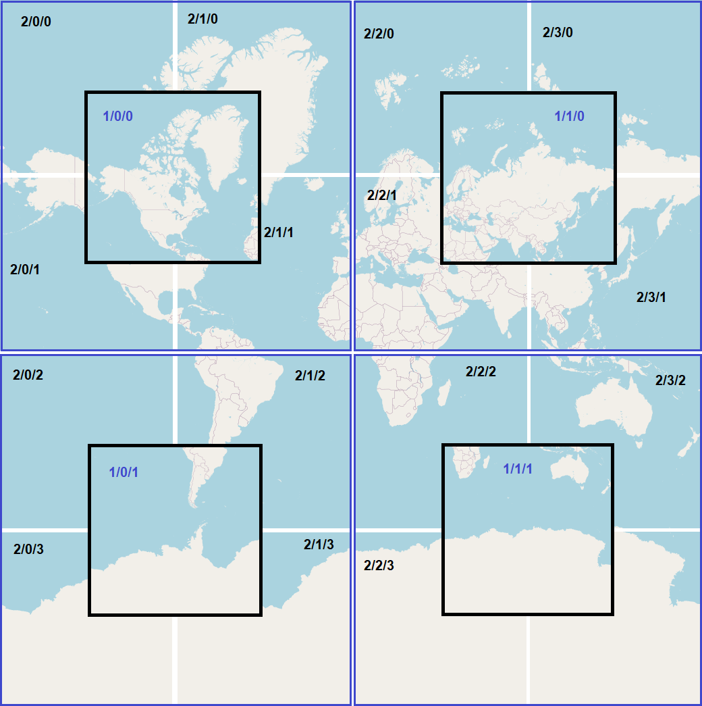

## Spring MVC/JPA + LeafLet (JS+CSS modules) + PostgreSQL

This small implementation was created to acquaint with LeafLet facilities and to test opportunities
of data storage with combination Spring MVC/JPA and map tile servers API. 

A **tiled web map**, slippy map (in OpenStreetMap terminology) or tile map is a map displayed in a web browser 
by seamlessly joining dozens of individually requested image or vector data files. It is the most popular 
way to display and navigate maps, replacing other methods such as Web Map Service (WMS) which typically 
display a single large image, with arrow buttons to navigate to nearby areas. Google Maps was one of the 
first major mapping sites to use this technique. The first tiled web maps used raster tiles, before the 
emergence of vector tiles.

OpenStreetMap maintains 20 zoom levels from 0 to 19. With zoom 0 all Earth surface appears in two images 
(by default, with resurrection 256px/256px). Zoom 1 and 2 are exposed on picture:



As you can see, each next zoom level (in the case of calculating the coordinates of a flat surface) details four times 
the images of the previous zoom level. With this approach, zoom level 0 contains 2 tile images, zoom level 
1 - 4 images (displayed in the picture) and zoom level 2 - 16 tile images (displayed in the picture).

Map tile server's API returns tiles images after GET request to URI match to pattern:
**https://somedomain.com/.../{z}/{x}/{y}.png**, where {z} — zoom level, {x} and {y} — tile coordinates.

To arrange tiles image storage, application need connection to PostgreSQL database with correct 'tiles'
table. To achieve this purpose your may run the command:

```shell
docker run --name LeafletTiles -p 5432:5432 -e POSTGRES_USER=user_name -e POSTGRES_PASSWORD=user_pwrd postgres:latest
```

It will download PostgreSQL image (if not exist) from Docker web repository and run container with needed
settings: POSTGRES_USER, POSTGRES_PASSWORD and connection port. By default, PostgreSQL docker container
stores database data in internal volume (part of a disk that's controlled by Docker daemon) and it is a good 
choice for testing purposes.

Now you can start application with IDE or Maven facilities, or with the command (it needs an installed Java 11
or later and adding path of a java/bin folder to OS %PATH% environment variable):

```shell
mvn clean install; java -jar ./target/LeafletOverView-1.0.jar
```

After execution, application will connect to default database **'postgres'** inside PostgreSQL docker 
container database server and will create needed table with SQL script file **'schema.sql'** (the file 
is in the folder 'resources').

### Resources:

* [Leaflet open-source JavaScript library](https://leafletjs.com/)
* [Leaflet API reference](https://leafletjs.com/reference.html#map-option)
* [Open street map foundation - Tile Usage Policy](https://operations.osmfoundation.org/policies/tiles/)
