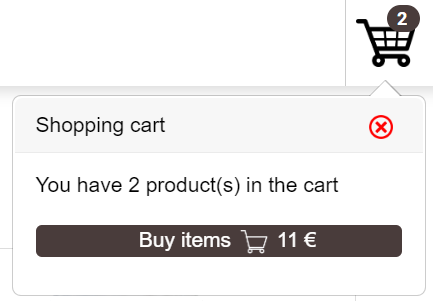
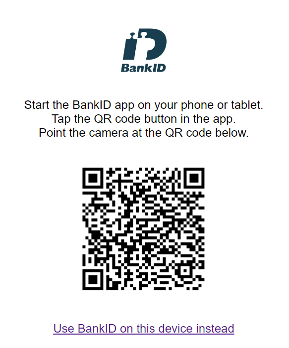
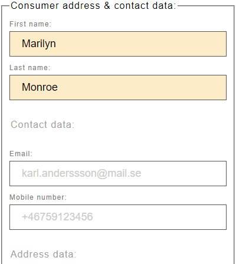
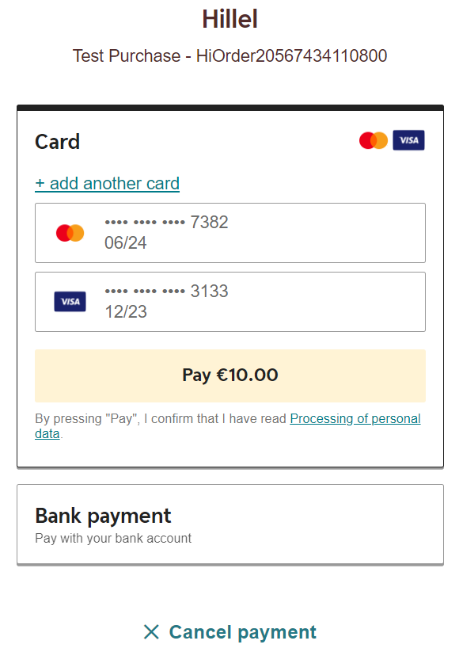
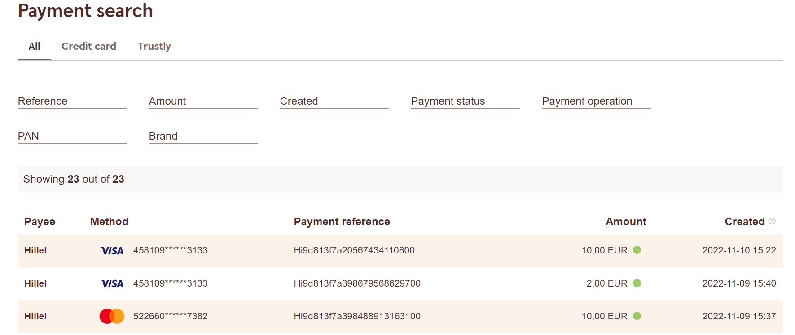

## About

**MAIN GOALs.** This application was created to test authentication and payment APIs supported by European banks. 
It contains the ability to define each payment property and checkout APIs responses in this approach. 

**TECHNICAL DETAILs.** Authentication of person (customer) implemented with using of BankId service. BankId security
system needs key and trust SSL certificates. The SwedBank service requires certain data to authenticate the merchant and
agreement with the definition of the SwedBank Pay solution. This application implements "Enterprise solution" with client
authentication on the seller's side. SwedBank stores test payment data for 6 month and allow to make POST payment operations
manual on the special net recourse. At this stage of development, the application does not need to store data in
own the database, but its design (with a separate data storage bean) makes it easy to implement this functionality.

**VISUALISATION.** To show the practical benefits of the problem being solved, the application looks like a small 
online store with intuitive interface and some additional features in the settings.

## Stages

1. Goods selection

It is necessary to pay attention to two types of supplied products:
- Goods (need delivery details)
- Digital services (e-delivery)

These parameters affect the correct choice of payment settings.

NB! This stage ends after clicking <strong>Buy items</strong> in the shopping cart: 

2. Person authentication

It is necessary to pay attention that "Other method" tool allow to enter personal data
without authentication. But the input data must match the input patterns.:

- BankID (needs installing BankId desktop app with test settings)

- Other e-Id (not supported)
- Other method (simple way pass this stage)

3. Payment settings

This page contains three different input areas. Areas with a blue background contain
default parameter values. Some of a field values can be disabled like incorrect in the
context of this payment. The central set of input fields is required.:

4. Making a payment

Payment page is managed by SwedBank and allow inserting any test data
with valid parameters. Examples of valid card numbers of a different payment 
systems are on the [relevant section](https://developer.swedbankpay.com/resources/test-data) 
of SwedBank developer portal:

5. Post payment operations

At this stage, the result of the payment is displayed and access to the SwedBank payment processing service is provided.
This service provides some additional features.

## Resources

Here are listed the essential resources needed for the implementation work:

* [Test platform of sweden BankId system](https://www.bankid.com/en/utvecklare/test)
* [SwedBank Pay Developer Portal](https://developer.swedbankpay.com)
