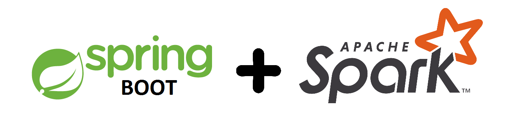
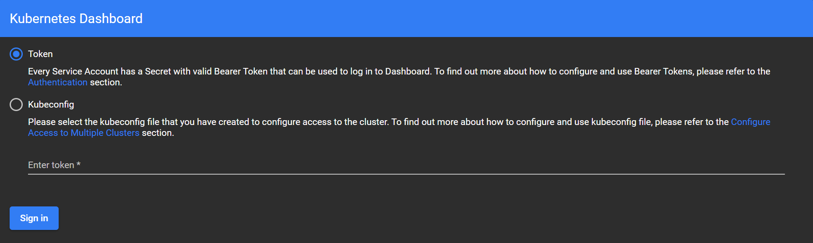
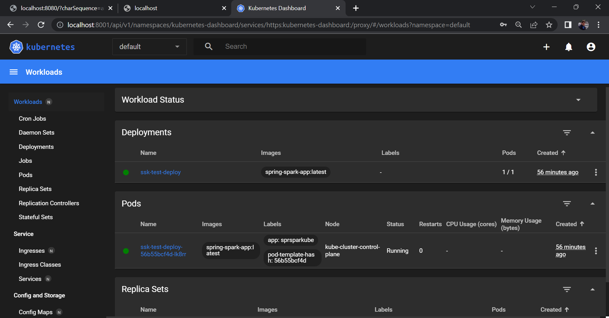
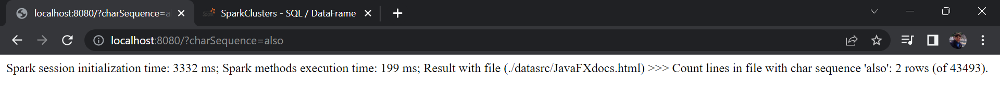
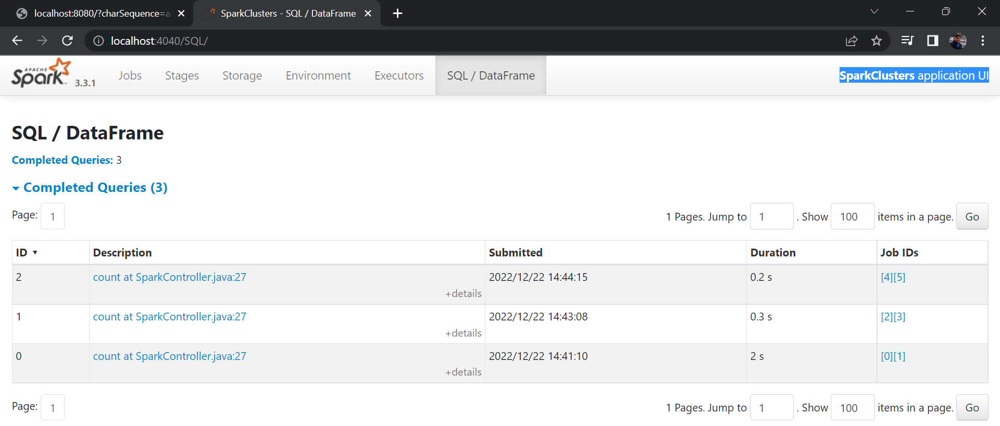

# Spring Boot + Spark + Docker + Kubernetes practice

## About

**MAIN GOALs.** This application was created for first acquaintance with Apache Spark capabilities within
Spring Boot MVC application in Kubernetes cluster environment, and it reviles opportunities of Spring Boot
interaction with Spark SQL Datasets.

**TECHNICAL DETAILs.** Correct running of app needs appropriate configuration of operating environment.
This tutorial exposes sequence of console command to set needed environment with Windows OS. Common sequence
of operations is suitable to other OSs.

    Most of encountered Spark implementation (including Docker images on official repo) are using Java 11 
    version. Attempt to execute official Spark installation within Java 17 environment has no result. 
    Therefore, using Java 11 is strictly recommended. 

According to documentation, Apache Spark currently supports several cluster managers:

- **Standalone** – a simple cluster manager included with Spark that makes it easy to set up a cluster.
- **Apache Mesos** – a general cluster manager that can also run Hadoop MapReduce and service applications. (Deprecated)
- **Hadoop YARN** – the resource manager in Hadoop 2 and 3.
- **Kubernetes** – an open-source system for automating deployment, scaling, and management of containerized
  applications.

Many authors believe that an effective approach is to use the Hadoop manager with the Kubernetes 
orchestrator. An increase of efficiency of the application is possible when measuring the speed of 
calculation on examples of specific tasks.

**VISUALISATION.** In this approach app has one endpoint for GET requests with args to execute Spark session
and methods to make simple response. Spark libraries as well as Kubernetes clusters support control plane UI.

    This implementation in order to simplify realization offers place all Kubernetes utils in ROOT 
    of module (.../SparkClusters) and use for informational purposes standard Windows PowerShell console 
    program integrated in IntelliJ IDEA IDE.

## Stages

<details><summary style="font-size: 18px">1. Jar file creation and first run</summary>

Inside the root module directory (.../SparkClusters), do a:

Build app jar file:

```shell
mvn clean install
```

Run the Spring Boot App (it requires a customized java 11 environment and local TCP ports 8080
and 4040 must be free):

```shell
java -jar ./target/SpringSparkK8STest-1.0.jar
```

Optionally, executing of the application with Maven settings:

```shell
mvn --projects smart.environment:SpringSparkK8STest spring-boot:run
```

Now go to [http://localhost:8080/](http://localhost:8080/).
You can define variable for Spark
methods: [http://localhost:8080/?charSequence=FX](http://localhost:8080/?charSequence=FX).

As a result, you will get the number of repetitions of this sequence of characters in the source file.

Spark UI service started at [http://localhost:4040/](http://localhost:4040/).

To stop application press "Ctrl + c".

</details>

<details><summary style="font-size: 18px">2. App within Docker environment</summary>

NB!  **Docker** daemon has to be running!

Docker image creation

```shell
docker build -t spring-spark-app .
```

Checking the functionality of the app with start/stop docker container

```shell
docker run --name=spring-spark-app-test --rm -p 8080:8080 -p 4040:4040 spring-spark-app
```

Now go to [http://localhost:8080/](http://localhost:8080/) and [http://localhost:4040/](http://localhost:4040/)
to check the result.

NB! To release ports for later use, you need to stop the Docker container by enforce closing of
console window or with a command:
```shell
docker stop spring-spark-app-test
```
</details>

<details><summary style="font-size: 18px">3. Kubernetes environment setting</summary>

Download **Kind util**:

```shell
curl.exe -Lo kind.exe https://kind.sigs.k8s.io/dl/v0.17.0/kind-windows-amd64
```

Download **kubectl util**:

```shell
curl.exe -Lo kubectl.exe https://dl.k8s.io/release/v1.26.0/bin/windows/amd64/kubectl.exe
```

NB!  **Docker** daemon has to be running!

Create a Kind default cluster (this command will download needed 'kindest/node' image, if it doesn't exist
in local Docker repo):

```shell
./kind create cluster --name kube-cluster
```

More usage can be discovered with:
```shell
./kind create cluster --help
```

Creation of additional cluster with another name:
```shell
./kind create cluster --name kube-another-name-cluster
```

Delete redundant cluster:
```shell
./kind delete cluster --name kube-another-name-cluster
```

    Optionally, you can collect all Kubernetes utils in custom folder and add path to this folder
    to system environment variable PATH.

</details>

<details><summary style="font-size: 18px">4. Deploy app to Kubernetes Kind local environment</summary>

Loading an Image Into Your Cluster:
```shell
./kind load docker-image spring-spark-app:latest --name kube-cluster
```

You can get a list of images present in the cluster node by using command (where kube-cluster-control-plane
is the name of the Docker container, obtained by adding '-control-plane' to the cluster name defined 
in kind command create cluster with flag --name):
```shell
docker exec -it kube-cluster-control-plane crictl images
```
Output has to contain row:

    docker.io/library/spring-spark-app         latest               .............       552MB

Kube pod creation and running with YAML files:
    kubectl apply -f SpringSparkK8SCommon.yaml
```shell
./kubectl apply -f SpringSparkK8SCommon.yaml
```

Let's check pod and service creation result inside Kubernetes cluster:
```shell
./kubectl get pods
```
Output has to contain rows (STATUS must be - Running):

    NAME                               READY   STATUS    RESTARTS   AGE
    ssk-test-deploy-56b55bcf4d-xkqqs   1/1     Running   0          ..s

```shell
./kubectl get services
```
Output has to contain rows:

    NAME               TYPE           CLUSTER-IP     EXTERNAL-IP   PORT(S)                     AGE
    ssk-test-service   LoadBalancer   xx.xx.xx.xxx   <pending>     80:...../TCP,81:...../TCP   ..s

Kubernetes implies using of online connection to cluster with suppoerted API and CoreDNS within.
Get CoreDNS address we can with command:
```shell
./kubectl cluster-info
```
</details>
<details><summary style="font-size: 18px">5. Kubernetes Dashboard setting and access to application</summary>

The Dashboard UI is not deployed by default. To deploy it, run the following command:
```shell
./kubectl apply -f https://raw.githubusercontent.com/kubernetes/dashboard/v2.6.1/aio/deploy/recommended.yaml
```

Dashboard only supports logging in with a Bearer Token. To create we need to create sample user:
```shell
./kubectl apply -f Dashboard-adminuser.yaml
```

Getting a Bearer Token:
```shell
./kubectl -n kubernetes-dashboard create token admin-user
```

To enable access to the Dashboard we use the kubectl command-line tool:
```shell
./kubectl proxy
```

Kubectl will make Dashboard available at 
[http://localhost:8001/api/v1/namespaces/kubernetes-dashboard/services/https:kubernetes-dashboard:/proxy/](http://localhost:8001/api/v1/namespaces/kubernetes-dashboard/services/https:kubernetes-dashboard:/proxy/)

Now copy the token and paste it into the 'Enter token field' on the login screen.

NB! We need correct copy in buffer of this token, without row ending hidden chars. For these purposes,
to run the above commands, it may be suitable to change Shell application.

Success:


Connection with Kubernetes API is possible only with auth features (like tokens, certificates etc),
which don't supported by a browsers. To provide connection between pod in Kubernetes cluster and any browser we can use internal service of
**Kubectl util** (commands must be run in separated console window).

NB! This commands may interrupt your internet connection!

For our Spring app port ('-n default' - is definition of namespace):
```shell
./kubectl port-forward svc/ssk-test-service 8080:80 -n default
```


For SparkClusters application UI:
```shell
./kubectl port-forward svc/ssk-test-service 4040:81 -n default
```


In Kubernetes, namespaces provides a mechanism for isolating groups of resources within a single cluster.
Names of resources need to be unique within a namespace, but not across namespaces. Namespace-based scoping
is applicable only for namespaced objects (e.g. Deployments, Services, etc) and not for cluster-wide objects
(e.g. StorageClass, Nodes, PersistentVolumes, etc).
</details>

## Resources

Here are listed the essential resources needed for the implementation work:

* [Cluster Mode Overview](https://spark.apache.org/docs/latest/cluster-overview.html)
* [Running Spark on Kubernetes](https://spark.apache.org/docs/latest/running-on-kubernetes.html)
* [Kubernetes install Tools](https://kubernetes.io/docs/tasks/tools/)
* [Kubernetes API Overview](https://kubernetes.io/docs/reference/generated/kubernetes-api/v1.20/#-strong-api-overview-strong-)

