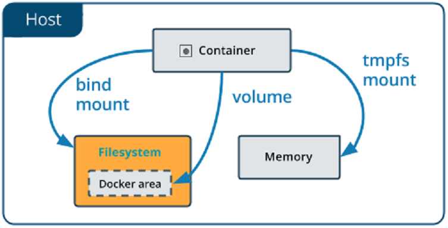

# Spring Boot + Spark Standalone Cluster + Docker

Spark provides a simple standalone deploy mode. We can launch a standalone cluster either manually, 
by starting a master and workers by hand, or use bundled launch scripts. It is also possible to run 
these daemons on a single machine for testing. Good option to test a Standalone cluster might be to 
run the cluster elements in **Docker environment**.

    This implementation in order to simplify realization offers place all Docker's an Spark files in the ROOT 
    of module (.../StandaloneClusterApp/) and use for informational purposes standard Windows PowerShell console 
    program integrated in IntelliJ IDEA IDE.

## Stages

Pre-requisites

1. Download JDK and add JAVA_HOME = <path_to_jdk_> as an environment variable.
2. Download Spark and add SPARK_HOME=<path_to_spark>. Add %SPARK_HOME% and %SPARK_HOME%/bin/ to PATH 
variable. If you choose to download spark pre-built with particular version of hadoop, no need to 
download it explicitly in step 3. In this case it is suitable to assign HADOOP_HOME = %SPARK_HOME%.
3. Download Hadoop and add HADOOP_HOME=<path_to_hadoop>, add %HADOOP_HOME% and %HADOOP_HOME%/bin/ to 
PATH variable. 
4. Download winutils.exe (for the same Hadoop version as above) and place it inside %HADOOP_HOME%/bin/.

<details><summary style="font-size: 18px">1. Starting a simple Spark Standalone cluster and connection of the Springboot 
application</summary>

To start Spark Standalone cluster manager:
```shell
spark-class org.apache.spark.deploy.master.Master --host 127.0.0.1 --port 7077
```
NB! Console window will be blocked by JVM during activity of the Spark cluster manager.

Allowed command options:
* -i HOST, --ip HOST     Hostname to listen on (deprecated, please use --host or -h)
* -h HOST, --host HOST   Hostname to listen on (in case of absence will be defined automatically, **--host 127.0.0.1 in this example**)
* -p PORT, --port PORT   Port to listen on (default: 7077, **--port 7077 explicitly defined in this example**)
* --webui-port PORT      Port for web UI (default: 8080)
* --properties-file FILE Path to a custom Spark properties file. Default is conf/spark-defaults.conf

#### In case of necessity to change Spark Standalone cluster settings it may be done by creating (with template) and editing of the file spark-defaults.conf located in %SPARK_HOME%/conf/ folder.

To start worker node #1 lets do this shell command in separated console window:
```shell
spark-class org.apache.spark.deploy.worker.Worker spark://127.0.0.1:7077 --host 127.0.0.1 --cores 4 --memory 4G
```

To start worker node #2 (in separated console window too):
```shell
spark-class org.apache.spark.deploy.worker.Worker spark://127.0.0.1:7077 --host 127.0.0.1 --cores 4 --memory 4G
```
NB! We must define net path (including host and port) to Spark Master (**spark://127.0.0.1:7077** in this example).

As you can see, new worker may be created by reiteration of the same shell command. 

Allowed command options:
* -c CORES, --cores CORES  Number of cores to use (**--cores 4 in this example**)
* -m MEM, --memory MEM     Amount of memory to use (e.g. 1000M, 2G, **--memory 4G in this example**)
* -d DIR, --work-dir DIR   Directory to run apps in (default: SPARK_HOME/work)
* -i HOST, --ip IP         Hostname to listen on (deprecated, please use --host or -h)
* -h HOST, --host HOST     Hostname to listen on (own worker's host, **--host 127.0.0.1 in this example**)
* -p PORT, --port PORT     Port to listen on (default: random)
* --webui-port PORT        Port for web UI (default: 8081)
* --properties-file FILE   Path to a custom Spark properties file. Default is conf/spark-defaults.conf.

#### In case of success of commands above we start simple Spark Standalone cluster on host 127.0.0.1 with port 7077 of cluster manager and two ports defined automatically for 2 worker nodes.

To start SpringBoot application and connect them to created cluster we have to check master.uri setting in 
**application.properties** file (for this example **master.uri=spark://127.0.0.1:7077** must be active) 
in resource folder of the StandaloneClusterApp module and revise Spark driver host in SpringBoot configuration
class **SparkConfig** (for this example **.set("spark.driver.host", "127.0.0.1")** must be active) in 
config folder.

To begin execution of the SpringBoot application we may use IntelliJ IDEA IDE facilities or execute 
shell command in separated console window with root module directory (../StandaloneClusterApp/):

NB! This command requires a configured Java 11 environment and local TCP ports 9091 and 9191 must be free!

```shell
mvn clean install; cd ..; java -jar ./StandaloneClusterApp/target/StandaloneClusterApp-1.0.jar
```
Now go to [http://localhost:9091/](http://localhost:9091/) where you can choose Spark method to 
execute: 
- to test Spark SQL DataSet filter method - [http://localhost:9091/clusterStandalone/selectionReport](http://localhost:9091/clusterStandalone/selectionReport);
- to test Spark SQL DataSet sorting method - [http://localhost:9091/clusterStandalone/sortingReport](http://localhost:9091/clusterStandalone/sortingReport);

As a result, you will get reports with execution time dimension inside.

Spark UI service started at [http://localhost:8080/](http://localhost:8080/).

To stop application and cluster elements press "Ctrl + c" or just close appropriate console window.

</details>

<details><summary style="font-size: 18px">2. Starting Spark Standalone cluster in Docker environment</summary>

Spark maintains configuration of a cluster by setting environment variables in conf/spark-env.sh or 
in OS environment (with using bundled scripts), by adding parameters to shell command we use to start
Spark cluster elements and by defining settings in spark-default.conf file in %SPARK_HOME%/conf/ folder.
Driver program (client application) settings may be defined in application Spark context and will be used 
by Spark cluster after connection.

#### In this implementation, if it is necessary to change the settings of the Spark Standalone cluster, this can be done by editing the spark-defaults file in the root folder of the StandaloneClusterApp module. In the future, this file will be located in %SPARK_HOME%/conf/ by executing a batch file (see below).
By default, in this implementation, the **spark-defaults** file contains only one parameter **spark.ui.reverseProxy   true** 
for simplifying access to the user interface of the Spark cluster in a Docker environment.

    **Docker** daemon has to be running, port 8080/TCP must be idle, and system variable **SPARK_HOME** 
    must contain path to Spark folder!

Spark core Docker image creation:
```shell
./SparkCoreDockerImageCreation.bat
```

Before we begin execution of our Spark cluster in Docker environment, we have to do one more thing.
Our application contains Spark SQL filter method, which select and count some char sequences in resource
file (**JavaFXdocs.html**) in folder **datasrc** of the module **StandaloneClusterApp**. To fulfill this
method by Spark cluster in Docker environment (where each element run in own container with own JVM
process) we need to provide access of each cluster element to resource file. To provide this we can 
leverage **volume** or **mount** options of **docker run** command. These options have some differences.

Mount also support **Bind mount**, which relies on the host machine’s filesystem having a specific 
directory structure available. If you are developing new Docker applications, consider using named 
volumes instead. 

Difference between **bind mount** and **value** revealed on diagram:



As you can see, with **volume**, a new directory is created within Docker’s storage directory on the 
host machine, and Docker manages that directory’s contents.

Create a volume:
```shell
docker volume create spark-data
```

Inspect a volume:
```shell
docker inspect spark-data
```

List volumes:
```shell
docker volume ls
```

Remove a volume:
```shell
docker volume rm <volume_name>
```

To check functionality of the image and find out internal Docker network host IP system lets do: 
```shell
docker run --name=spark-master-test --rm -p 8080:8080 spark-cluster-core spark-class org.apache.spark.deploy.master.Master
```

Now go to [http://localhost:8080/](http://localhost:8080/) and check UI performance.
As you can see UI index page contains Master address (Spark Master at spark://172.17.0.2:7077).
This address include Docker internal container **IP: 172.17.0.2** and default **port: 7077**.

By running command (below) we can check settings of default Docker network driver **bridge**, which is
used with containers without explicit network definition.
```shell
docker network inspect bridge
```

Output will contain data about bridge setting and include **IPAM** settings:

    "IPAM": {
        "Driver": "default",
        "Options": null,
        "Config": [
            {
                "Subnet": "172.17.0.0/16",
                "Gateway": "172.17.0.1"
            }
        ]
    },

In this example, IP **172.17.0.1** is already taken by **Gateway**. Other IP addresses will be used 
to assign IP addresses containers in their launch order.

Let's check IP address of our **spark-master** container. It is looks like:

    "Containers": {
        "a239d5d3a19c6606be7eff5c52f923faee1073329173072149f5813d0d08ed52": {
            "Name": "spark-master",
            "EndpointID": "61f2a0f50a1889d2c0cea07d83011d40aaee370258ef719ae61fad93af0c1b11",
            "MacAddress": "02:42:ac:11:00:02",
            "IPv4Address": "172.17.0.2/16",
            "IPv6Address": ""
        }
    },

In this example container **"Name": "spark-master"** has **"IPv4Address": "172.17.0.2/16"** and it 
matches IP address specified on the Spark UI page. 

To arrange connection between container JVM processes (which run Spark cluster members) in Docker
environment, we need to notice these JVM processes about Master's address and the IP addresses of 
the containers they are running in. Moreover, we have to do it in stage of cluster configuration before 
starting of Spark cluster elements in Docker containers. In this irregular situation we need to "predict"
these addresses:), but since Docker assigns container IP in order of its launch with default net bridge, 
it is possible to do. 

NB! With user-defined bridge networks we can assign container IP manually.

Let's stop our test container **spark-master** by forced closing of console window it is running in, or
by command:
```shell
docker stop spark-master-test
```

To start Cluster manager (master) with explicit IP address definition (**--host 172.17.0.2**:
```shell
docker run --name=spark-master --rm -p 8080:8080 -v spark-data:/opt/StandaloneClusterApp/datasrc spark-cluster-core spark-class org.apache.spark.deploy.master.Master --host 172.17.0.2
```

Option **-v spark-data:/opt/StandaloneClusterApp/datasrc** in this command defines **volume** binding of
**spark-master** container. 
</details>

<details><summary style="font-size: 18px">3. Starting SpringBoot-Spark app and Workers in Docker environment</summary>

Before running our SpringBoot-Spark app in Docker environment we need to check master.uri setting in
**application.properties** file (for this example 
**master.uri=spark://172.17.0.2(or IP in your Docker environment):7077** must be active)
in resources folder of the StandaloneClusterApp module and revise Spark driver host in SpringBoot configuration
class **SparkConfig** (for this example 
**.set("spark.driver.host", "172.17.0.3(or next IP after Master container IP in your Docker environment)")** 
must be active) in config folder.

To create Docker image of SpringBoot-Spark app:
```shell
mvn clean install; docker build --rm -t spring-spark-app .
```

To run SpringBoot-Spark app in Docker:
```shell
docker run --name=spark-cluster-app --rm -p 9091:9091 -v spark-data:/opt/StandaloneClusterApp/datasrc spring-spark-app
```

Console window with Spark Master JVM process notifies us: 

    ...
    23/01/05 11:47:24 INFO Master: Registering app StandaloneClusterApp
    23/01/05 11:47:24 INFO Master: Registered app StandaloneClusterApp with ID app-20230105114724-0000
    23/01/05 11:47:24 WARN Master: App app-20230105114724-0000 requires more resource than any of Workers could have.

Therefore, we need to start Spark Workers JVM processes in separated Docker containers and connect them to 
Master container Spark JVM process.

Worker #1 (**in this example container host: 172.17.0.4**). We allocate to worker: 
cores - 4, memory - 4Gb.
```shell
docker run --name=spark-worker-1 --rm -v spark-data:/opt/StandaloneClusterApp/datasrc spark-cluster-core spark-class org.apache.spark.deploy.worker.Worker spark://172.17.0.2:7077 --host 172.17.0.4 --cores 4 --memory 4G
```

Worker #2 (**in this example container host: 172.17.0.5**) with cores - 4, memory - 4Gb too:
```shell
docker run --name=spark-worker-2 --rm -v spark-data:/opt/StandaloneClusterApp/datasrc spark-cluster-core spark-class org.apache.spark.deploy.worker.Worker spark://172.17.0.2:7077 --host 172.17.0.5 --cores 4 --memory 4G
```
Console window with Spark Master JVM process notifies us (something like this):

    ...
    23/01/05 12:01:32 INFO Master: Registering worker 172.17.0.4:33101 with 4 cores, 4.0 GiB RAM
    23/01/05 12:01:32 INFO Master: Launching executor app-20230105114724-0000/20 on worker worker-20230105120131-172.17.0.4-33101
    23/01/05 12:01:32 INFO Master: Launching executor app-20230105114724-0000/21 on worker worker-20230105120131-172.17.0.4-33101
    23/01/05 12:03:54 INFO Master: Registering worker 172.17.0.5:46757 with 4 cores, 4.0 GiB RAM
    23/01/05 12:03:54 INFO Master: Launching executor app-20230105114724-0000/22 on worker worker-20230105120353-172.17.0.5-46757
    23/01/05 12:03:54 INFO Master: Launching executor app-20230105114724-0000/23 on worker worker-20230105120353-172.17.0.5-46757

Now go to [http://localhost:9091/](http://localhost:9091/) where you can choose Spark method to
execute:
- to test Spark SQL DataSet filter method - [http://localhost:9091/clusterStandalone/selectionReport](http://localhost:9091/clusterStandalone/selectionReport);
- to test Spark SQL DataSet sorting method - [http://localhost:9091/clusterStandalone/sortingReport](http://localhost:9091/clusterStandalone/sortingReport);

Spark UI service started at [http://localhost:8080/](http://localhost:8080/).

To stop application and cluster elements press "Ctrl + c" or just close appropriate console window.
</details>

## Resources

Here are listed the essential resources needed for the implementation work:

* [Spark Cluster Mode Overview](https://spark.apache.org/docs/latest/cluster-overview.html)
* [Spark Standalone Mode](https://spark.apache.org/docs/latest/spark-standalone.html)
* [Spark Configuration](https://spark.apache.org/docs/latest/configuration.html)
* [Networking with standalone containers](https://docs.docker.com/network/network-tutorial-standalone/)
* [Bind mounts](https://docs.docker.com/storage/bind-mounts/)
* [Volumes](https://docs.docker.com/storage/volumes/)

