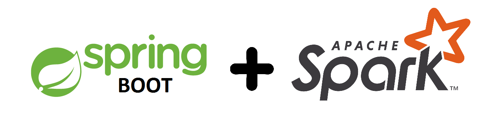
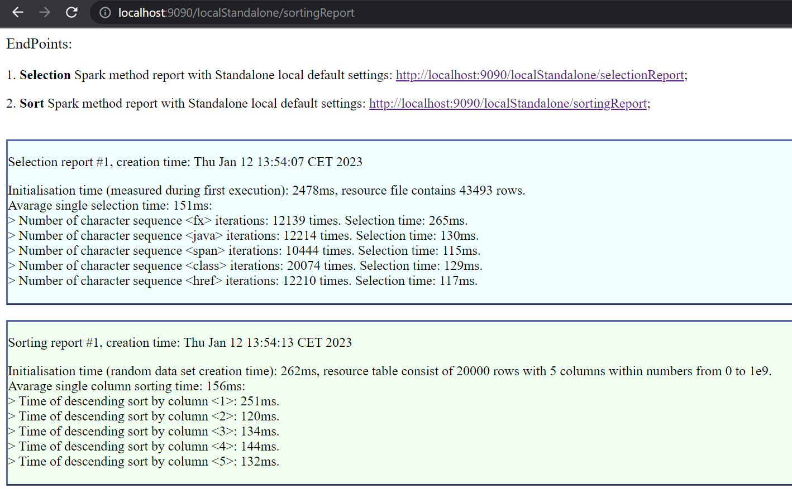

# Spring Boot + Spark + Cluster managers

## About

**MAIN GOALs.** This branch was created for first acquaintance with Apache Spark capabilities within
Spring Boot MVC application in different cluster environments, and it reveals opportunities of Spring Boot
interaction with Spark SQL Datasets.

**TECHNICAL DETAILs.** Correct running of modules needs appropriate configuration of operating environment.
Module's tutorials contain sequence of Windows OS console commands. Order of operations is suitable to other OSs.

    Most of encountered Spark implementation (including Docker images in the official repository) are 
    using Java 11 version. Attempt to execute official Spark installation within Java 17 environment 
    has no result. Therefore, using Java 11 is strictly recommended. 

According to documentation, Apache Spark currently supports several cluster managers:

- **Standalone** – a simple cluster manager included with Spark that makes it easy to set up a cluster.
- **Apache Mesos** – a general cluster manager that can also run Hadoop MapReduce and service applications. (Deprecated)
- **Hadoop YARN** – the resource manager in Hadoop 2 and 3.
- **Kubernetes** – an open-source system for automating deployment, scaling, and management of containerized
  applications.

This branch contains modules:

* Module **StandaloneApp** implement execution of Spring/Spark application (with Spark Standalone local mode)
in Kubernetes environment. As a result you will receive started Spring MVC app with connected Spark and 
Kubernetes user interfaces.

* Module **StandaloneClusterApp** implements execution of Spark Cluster in Standalone mode, with Master and
Worker elements within, in OS and Docker environment and connection to it of Spring/Spark application.
This implementation exposes the ability to run Spark Cluster on multiple local computers connected by a network.

**VISUALISATION.** App has two endpoints for GET requests without args to execute Spark session
and to use Spark SQL library methods (for sorting and selection) to receive simple execution reports:

Spark libraries as well as Kubernetes clusters support dashboard User Interfaces, screenshots of which are shown 
in the appropriate modules.

    This implementation in order to simplify realization places needed files (e.g. Kubernetes utils files)
    in ROOT of modules and uses standard Windows PowerShell console program integrated in IntelliJ IDEA IDE.

## Resources

Here are listed the essential resources needed for the implementation work:

* [Cluster Mode Overview](https://spark.apache.org/docs/latest/cluster-overview.html)
* [Spark Standalone Mode](https://spark.apache.org/docs/latest/spark-standalone.html)
* [Spark Configuration](https://spark.apache.org/docs/latest/configuration.html)
* [Running Spark on Kubernetes](https://spark.apache.org/docs/latest/running-on-kubernetes.html)
* [Kubernetes install Tools](https://kubernetes.io/docs/tasks/tools/)
* [Kubernetes API Overview](https://kubernetes.io/docs/reference/generated/kubernetes-api/v1.20/#-strong-api-overview-strong-)
* [Networking with standalone containers](https://docs.docker.com/network/network-tutorial-standalone/)
* [Bind mounts](https://docs.docker.com/storage/bind-mounts/)
* [Volumes](https://docs.docker.com/storage/volumes/)
