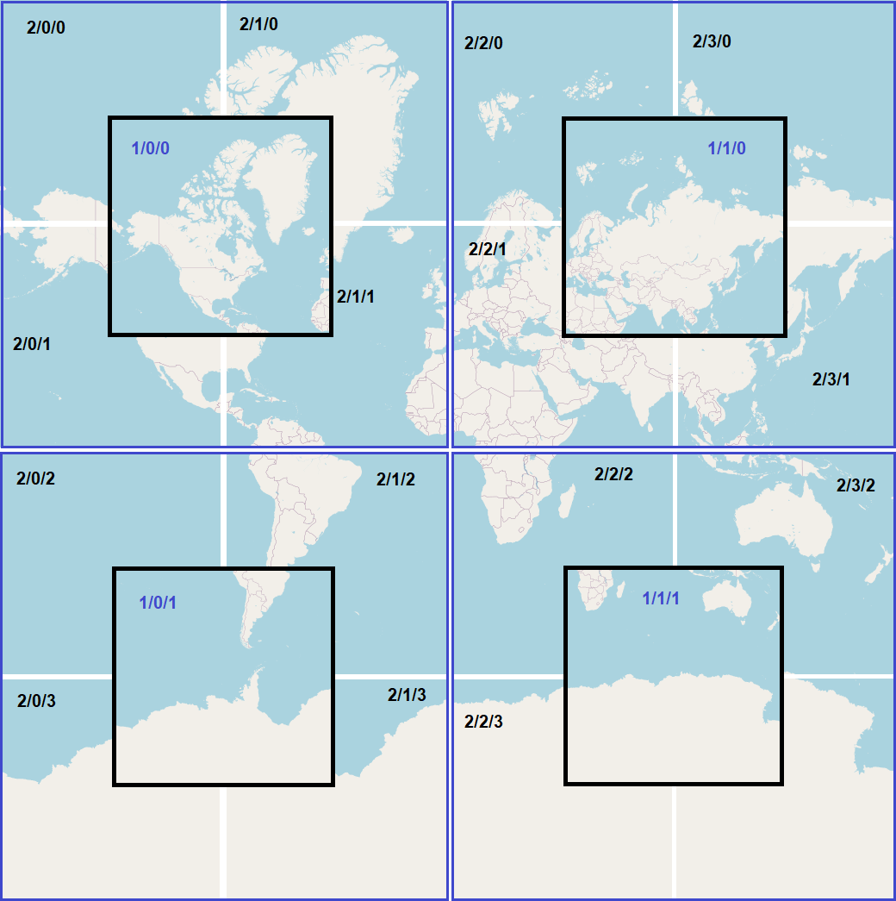
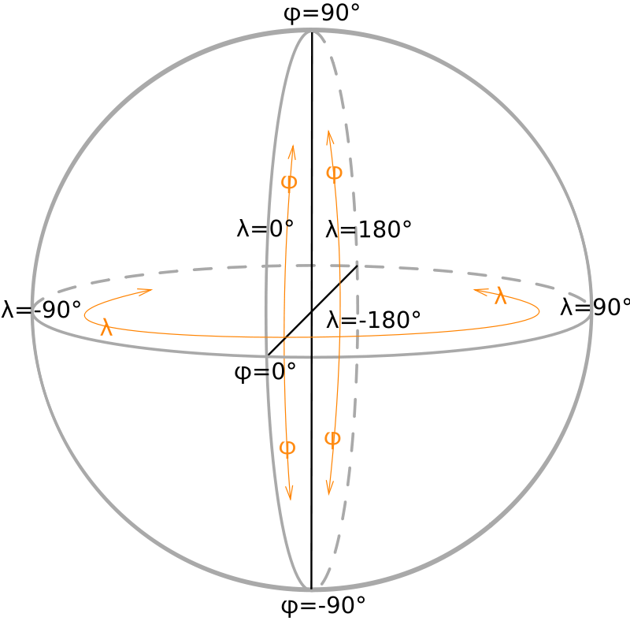
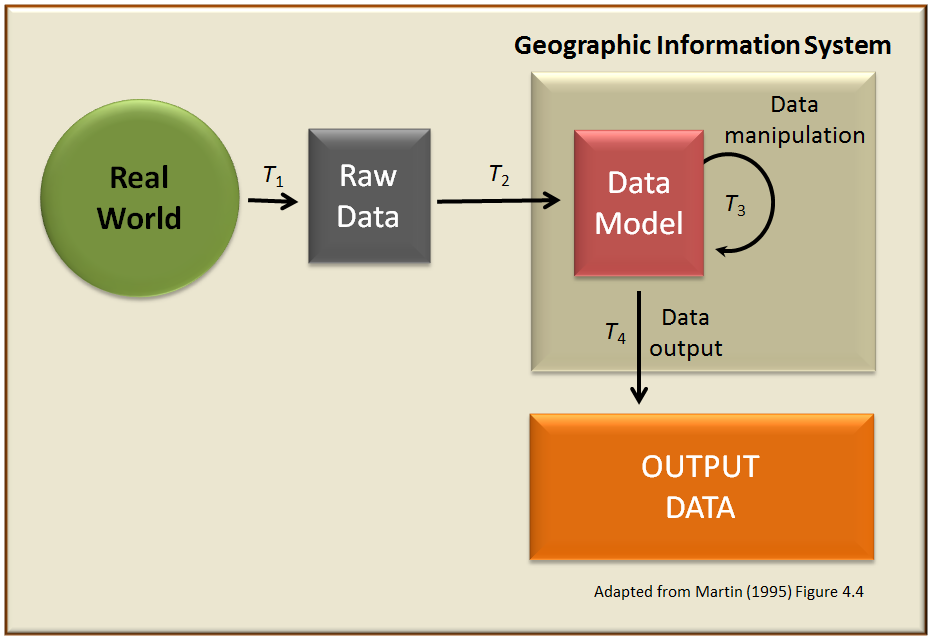
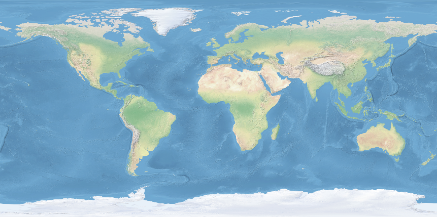
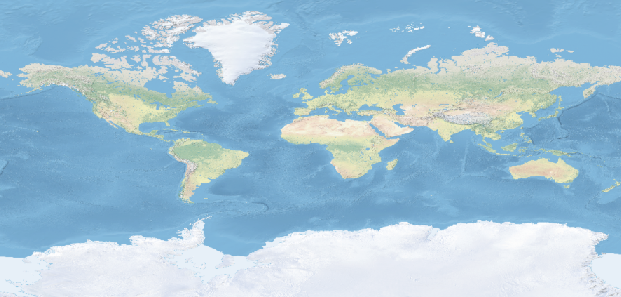
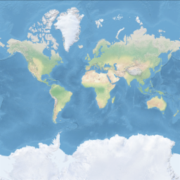
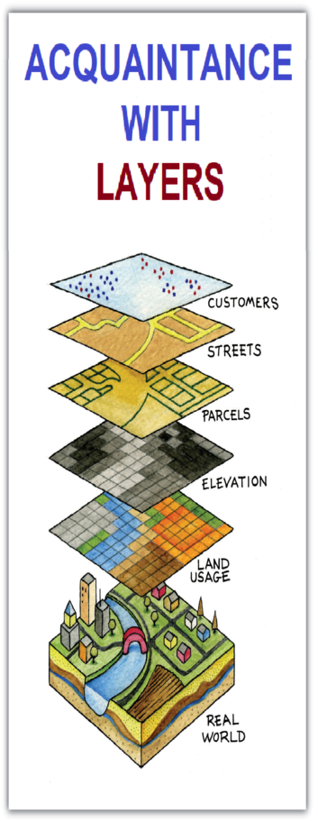

## Spring MVC/JPA + LeafLet (JS+CSS modules) + GeoTools + PostgreSQL

This small implementation was created to acquaint with LeafLet and GeoTools facilities (including tools 
to retrieve geo data from geoTiff files, transformation geo data with different Coordinate reference 
systems, cropping and scaling small pieces of geo data) and to test opportunities of data storage with 
using Spring MVC/JPA as a map tile server API. 

A **tiled web map**, slippy map (in OpenStreetMap terminology) or tile map is a map displayed in a web browser 
by seamlessly joining dozens of individually requested image or vector data files. It is the most popular 
way to display and navigate maps, replacing other methods such as Web Map Service (WMS) which typically 
display a single large image, with arrow buttons to navigate to nearby areas. Google Maps was one of the 
first major mapping sites to use this technique. The first tiled web maps used raster tiles, before the 
emergence of vector tiles.

OpenStreetMap maintains 20 zoom levels from 0 to 19. With **zoom 0** all Earth surface appears in one image 
(with resolution 256px/256px). Zoom 1 and 2 are exposed on picture:



As you can see, each next zoom level (in the case of calculating the coordinates of a flat surface) details
four times more images of the previous zoom level. With this approach, zoom level 0 contains 1 fragment image,
zoom level 1 contains 4 images (displayed in the picture), and zoom level 2 contains 16 fragment images 
(displayed in the image).

Map tile server's API returns tiles images after GET request to URI match to pattern:
**https://somedomain.com/.../{z}/{x}/{y}.png**, where {z} — zoom level, {x} and {y} — tile coordinates.

One of the goals of this implementation is to attempt to create a geomap tile API using Earth wrapper 
geoTiff data with complete coverage of entire surface of the Earth in any CRS (Coordinate reference system)
with latitude from -90° to 90° and longitude from -180° to 180°:



Good source geoTiff files can provide [www.naturalearthdata.com](https://www.naturalearthdata.com/downloads/50m-raster-data/)

To download a medium resolution geoTiff file:
```shell
curl https://naciscdn.org/naturalearth/50m/raster/NE2_50M_SR_W.zip -o NE2_50M_SR_W.zip
```

and unzip it to the folder for use by the application:
```shell
Expand-Archive -Force NE2_50M_SR_W.zip ./input
```

All geodata servers work as shown in the diagram:



This application transforms geoTiff files (CRS defined in a metadata) to tiles with size 256px x 256px
with CRS - EPSG:3857 and geo scale matching LeafLet and OpenStreetMap properties. To achieve this goal
app uses GeoTolls libraries to transform data from one CRS to another. 

For example, max scale zoom view of Earth in EPSG:3857 looks like:



1. transformed to CRS EPSG:4326:



2. transformed to OpenStreetMap tile with CRS EPSG:4326 (zoom 0):



As you can see they very differ (compare square of Greenland on these images).

After data transformation, app creates tiles with GeoTools and ImgScalr libraries after web browser 
requests ruled by LeafLet JS libraries.

To arrange tiles image storage, application need connection to PostgreSQL database with correct 'tiles' tables. 
To achieve this purpose your may run the command:

```shell
docker run --name LeafletTiles -p 5432:5432 -e POSTGRES_USER=user_name -e POSTGRES_PASSWORD=user_pwrd postgres:latest
```

It will download PostgreSQL image (if not exist) from Docker web repository and run container with needed
settings: POSTGRES_USER, POSTGRES_PASSWORD and connection port. By default, PostgreSQL docker container
stores database data in internal volume (part of a disk that's controlled by Docker daemon) and it is a good 
choice for testing purposes.

Now you can start application with IDE or Maven facilities, or with the command (it needs an installed Java 11
or later and adding path of a java/bin folder to OS %PATH% environment variable):

```shell
cd LeafletOverView; mvn clean install; cd ..; java -jar ./LeafletOverView/target/LeafletOverView-1.0.jar
```

After execution, application will connect to default database **'postgres'** inside PostgreSQL docker 
container database server and will create needed table with SQL script file **'schema.sql'** (the file 
is in the folder 'resources').

To see result: [http://localhost:8080/](http://localhost:8080/). 

Note! After the first launch, the application will create geoTiff tiles, receive tiles from OpenStreetMap, 
display tiles and place them in the database (to increase speed of app). Working with a large amount of 
data requires significant computing power, especially in the case of trying to use "heavy" geo tiff files.
This may cause application speed issues. In this case, it is possible to disable support for geoTiff maps by setting 
**application.geofile.provided** to **false** in the **application.properties** file. Also, this file contains
other app properties, including tile source server, input/output files and folders, coordinate system 
corrections, which allow to precisely match geoTiff map to OpenStreetMap.  

To get know about capabilities of combining different layers with a digital map surface click on the image:



This simple layer editor implementation reveals ways to add different type layers to a map (for further
using in versatile business processes), storing and retrieve them with a database. 


### Resources:

* [Leaflet open-source JavaScript library](https://leafletjs.com/)
* [Leaflet API reference](https://leafletjs.com/reference.html#map-option)
* [Open street map foundation - Tile Usage Policy](https://operations.osmfoundation.org/policies/tiles/)
