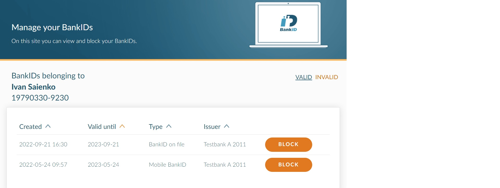

##  Authentication process diagram 
The common diagram of authentication with BankID App looks like: 

## Test custom User Data on www.bankid.com
For informational purposes used test mode with definition of custom User data:

For test purposes was selected e-signing mode, which launched BankID App with request of User password:

Successful result:
